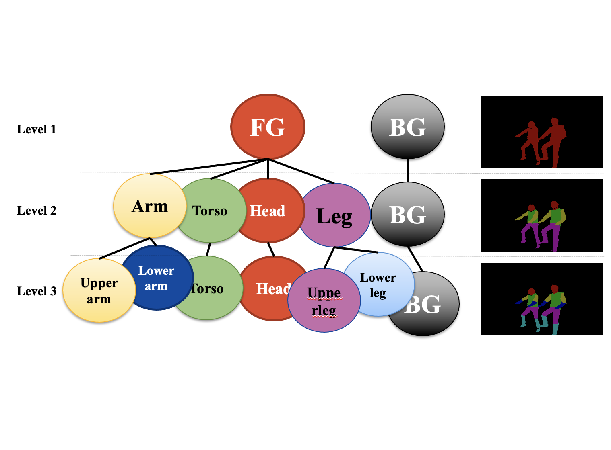

### About me
---
I am a research engineer at TikTok Sydney. Previously, I completed my PhD at  Monash University, supervised by [Asst. Prof. Bohan Zhuang](https://bohanzhuang.github.io/) and [Prof. Jianfei Cai](https://jianfei-cai.github.io/). Before joining [Zip Lab](https://ziplab.github.io/), I obtained my M.Phil. and Bachelor's degrees from the University of Sydney under the supervision of [Prof. Dacheng Tao](https://www.sydney.edu.au/engineering/about/our-people/academic-staff/dacheng-tao.html) and [Dr. Jing Zhang](https://scholar.google.com/citations?user=9jH5v74AAAAJ&hl=en). 
My research interests include efficiency problems in deep learning scenarios, multi-modal LLMs, and segmentation tasks.

### News!
---
- [03/2024] Our paper [ESTA](https://arxiv.org/abs/2311.17352) on model stitching and adaptation got accepted by CVPR 2024!
- [12/2023] Our paper [SPViT](https://arxiv.org/abs/2111.11802) on visual Transformer pruning got accepted by TPAMI!
- [11/2023] I have joined TikTok Sydney as a research engineer intern working on efficient video LLMs!
- [09/2023] Our paper [MPVSS](https://arxiv.org/abs/2310.18954) on efficient video segmentation got accepted by NeurIPS 2023!
- [08/2023] Our paper [SPT](https://arxiv.org/abs/2303.08566) on adaptive parameter-efficient fine-tuning got accepted by ICCV 2023 for oral presentation!
- [07/2023] Our paper [EOPNet](https://arxiv.org/abs/2105.01241) on data-efficient human parsing got accepted by TPAMI!
- [02/2023] Our [survey paper](https://arxiv.org/abs/2302.01107) on efficient training of transformers got accepted by IJCAI 2023!
- [02/2023] Our paper [FASeg](https://arxiv.org/abs/2204.01244) on adaptive semantic segmentation got accepted by CVPR 2023!
- [09/2022] Our paper [Ecoformer](https://arxiv.org/abs/2209.09004) on energy-saving attentions got accepted by NeurIPS 2022!
- [12/2021] Our paper [LIT](https://arxiv.org/abs/2105.14217) on efficient transformer architectures got accepted by AAAI 2022!
- [07/2021] Our paper [HVT](https://arxiv.org/abs/2103.10619) on efficient transformer architectures got accepted by ICCV 2021!
- [12/2020] Our paper [POPNet](https://arxiv.org/abs/2012.11810) on data-efficient human parsing got accepted by AAAI 2021!
- [12/2019] Our paper [Grapy-ML](https://arxiv.org/abs/2012.11810) on cross-dataset human parsing got accepted by AAAI 2020!

### Papers
---

[comment]: <> (
)

[comment]: <> (  <link rel="stylesheet" href="https://maxcdn.bootstrapcdn.com/bootstrap/4.0.0/css/bootstrap.min.css">)

[comment]: <> (  )

[comment]: <> (
)

[comment]: <> (  
)

[comment]: <> (    
)

[comment]: <> (      
)

[comment]: <> (        
)

[comment]: <> (          )

[comment]: <> (        
)

[comment]: <> (        
)

[comment]: <> (          
)

[comment]: <> (            <h2>[Title of the paper]</h2>)

[comment]: <> (            
<i>Author List</i>
)

[comment]: <> (            
[Extra line of text to introduce the paper]
)

[comment]: <> (          
)

[comment]: <> (        
)

[comment]: <> (      
)

[comment]: <> (    
)

[comment]: <> (  
)

[comment]: <> (
)

[comment]: <> (
)

<head>
  
</head>

  

      
  

  

    
 Efficient Stitchable Task Adaptation [CVPR 2024] 

    
Haoyu He, Zizheng Pan, Jing Liu, Jianfei Cai, Bohan Zhuang

    
<a href="https://arxiv.org/abs/2111.11802"> PDF</a> / <a href="https://github.com/ziplab/SPViT"> Code </a> 

  

  

      
  

  

    
 Pruning Self-attentions into Convolutional Layers in Single Path [TPAMI 2024] 

    
Haoyu He, Jing Liu, Zizheng Pan, Jianfei Cai, Jing Zhang, Dacheng Tao, Bohan Zhuang

    
<a href="https://arxiv.org/abs/2111.11802"> PDF</a> / <a href="https://github.com/ziplab/SPViT"> Code </a> 

  

  

      
  

  

    
 Mask Propagation for Efficient Video Semantic Segmentation [NeurIPS 2023] 

    
Yuetian Weng, Mingfei Han, Haoyu He, Mingjie Li, Lina Yao, Xiaojun Chang, Bohan Zhuang

    
<a href="https://arxiv.org/abs/2310.18954"> PDF</a> / <a href="https://github.com/ziplab/MPVSS"> Code </a> 

  

  

      
  

  

    
 Sensitivity-Aware Visual Parameter-Efficient Tuning [ICCV 2023] (oral) 

    
 Haoyu He, Jianfei Cai, Jing Zhang, Dacheng Tao, Bohan Zhuang

    
<a href="https://arxiv.org/abs/2303.08566"> PDF</a> / <a href="https://github.com/ziplab/spt"> Code </a> 

  

  

      
  

  

    
 End-to-end One-shot Human Parsing [TPAMI 2023] 

    
 Haoyu He, Jing Zhang, Bohan Zhuang, Jianfei Cai, Dacheng Tao

    
<a href="https://arxiv.org/abs/2105.01241"> PDF</a> / <a href="https://github.com/Charleshhy/One-shot-Human-Parsing"> Code </a> 

  

  

      
  

  

    
 A Survey on Efficient Training of Transformers [IJCAI 2023] 

    
 Bohan Zhuang, Jing Liu, Zizheng Pan, Haoyu He, Yuetian Weng, Chunhua Shen

    
<a href="https://arxiv.org/abs/2302.01107"> PDF</a>

  

  

      
  

  

    
 Dynamic Focus-aware Positional Queries for Semantic Segmentation [CVPR 2023] 

    
 Haoyu He, Jianfei Cai, Zizheng Pan, Jing Liu, Jing Zhang, Dacheng Tao, Bohan Zhuang

    
<a href="https://arxiv.org/abs/2204.01244"> PDF</a> / <a href="https://github.com/ziplab/FASeg"> Code </a> 

  

  

      
  

  

    
 EcoFormer: Energy-Saving Attention with Linear Complexity [NeurIPS 2022] (highlight) 

    
Jing Liu, Zizheng Pan, Haoyu He, Jianfei Cai, Bohan Zhuang

    
<a href="https://arxiv.org/abs/2209.09004"> PDF</a> / <a href="https://github.com/ziplab/EcoFormer"> Code </a> 

  

  

      
  

  

    
 Less is More: Pay Less Attention in Vision Transformers [AAAI 2022] 

    
Zizheng Pan, Bohan Zhuang, Haoyu He, Jing Liu, Jianfei Cai

    
<a href="https://arxiv.org/abs/2105.14217"> PDF</a> / <a href="https://github.com/ziplab/LIT"> Code </a> 

  

  

      
  

  

    
 Progressive One-shot Human Parsing [AAAI 2021] (oral) 

    
Haoyu He, Bohan Zhuang, Jing Zhang, Jianfei Cai, Dacheng Tao

    
<a href="https://arxiv.org/abs/2105.01241"> PDF</a> / <a href="https://github.com/Charleshhy/One-shot-Human-Parsing"> Code </a> 

  

  

      
  

  

    
 Grapy-ML: Graph Pyramid Mutual Learning for Cross-dataset Human Parsing [AAAI 2020] (oral) 

    
Haoyu He, Jing Zhang, Qiming Zhang, Dacheng Tao

    
<a href="https://arxiv.org/abs/1911.12053"> PDF</a> / <a href="https://github.com/Charleshhy/Grapy-ML"> Code </a> 

  

### Services
---
Reviewer for CVPR, ECCV, ICCV, NeurIPS, AAAI, TPAMI, and TMM.

### Teaching
---
Teaching associate for
- COMP5318 - Machine Learning and Data Mining (USYD, 2020)
- COMP5349 - Cloud Computing (USYD, 2020)
- FIT5047 - Fundamentals of Artificial Intelligence (Monash, 2023).
- FIT5201 - Machine Learning (Monash, 2023)
